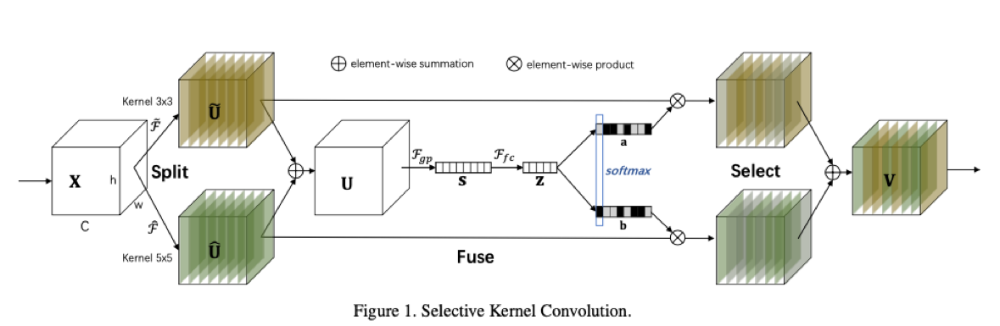

# SKNet-paddle

基于[paddle](https://github.com/PaddlePaddle/Paddle)框架的[Selective Kernel Networks](https://arxiv.org/pdf/1903.06586.pdf)实现

## 一、简介

本项目基于[paddle](https://github.com/PaddlePaddle/Paddle)复现[Selective Kernel Networks](https://arxiv.org/pdf/1903.06586.pdf)中提出的SKNet-50模型。该模型利用非线性的方法整合信息，以实现动态调整RF的大小。主要思想是提出了“Selective Kernel” (SK) convolution。包含 Split - Fuse - Select  三个部分：

Split：分出多个支流，每一个支流都有不同大小的filter/kernel size，以此来实现不同大小的RF；

Fuse：整合支流的信息，然后获得selection weights；

Select ：通过selection weights来聚合feature map。



**论文:**

- [1] Xiang Li, Wenhai Wang, Xiaolin Hu and Jian Yang, "Selective Kernel Networks", CVPR 2019.

**参考项目:**

- https://github.com/rwightman/pytorch-image-models 
- https://github.com/PaddlePaddle/PaddleClas

## 二、快速开始

### 2.1 clone

```
# clone this repo
git clone https://github.com/lvjian0706/SKNet-paddle.git
cd SKNet-paddle
```

### 2.2 安装环境及依赖

```
pip install -r requirements.txt
```

### 2.3 模型训练

```
bash tools/train.sh
```

默认为4卡训练，单卡训练需要更改 `train.sh` 文件并根据 `batch size` 的变化调整学习率大小。

### 2.4 模型评估

```
bash tools/val.sh
```

默认为4卡训练，单卡训练需要更改 `val.sh` 文件。

## 三、预训练模型

链接: https://pan.baidu.com/s/1gJgz_MD5ei_4qYZf5RWHYg  密码: ib38

ACC Top1:78.834 Top5:94.282
